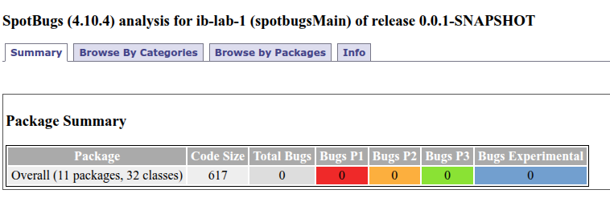
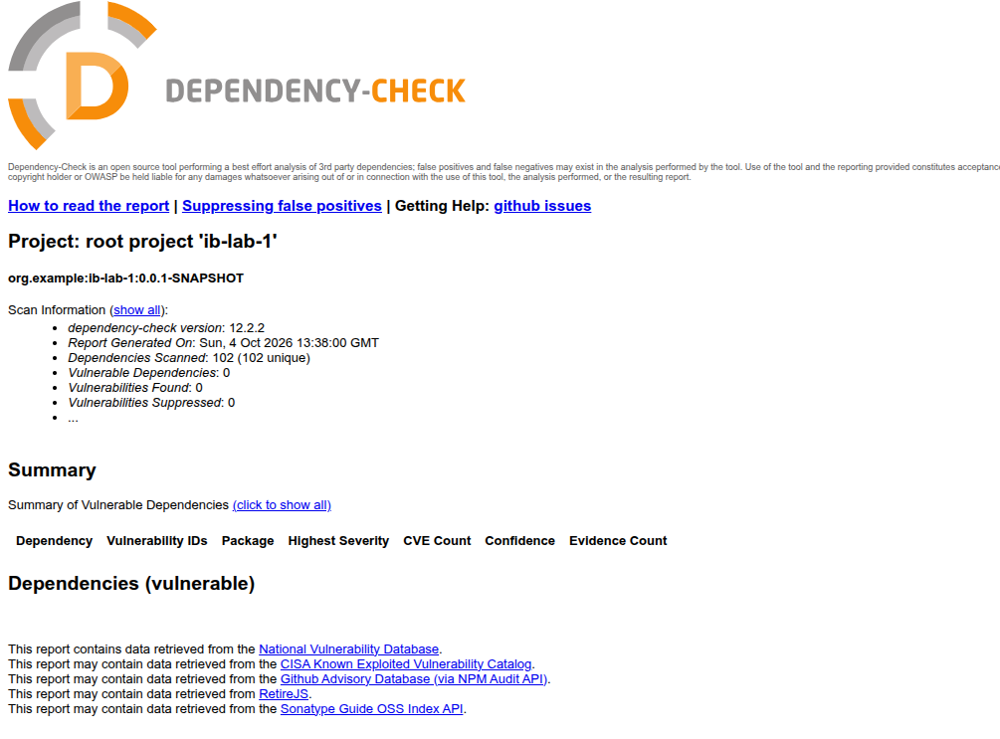

# ib-lab-1 — защищённый REST API

Лабораторная работа 1: backend-приложение на Spring Boot с регистрацией, JWT-аутентификацией
и публикацией постов, защищённое от OWASP Top 10 (SQLi, XSS, Broken Authentication).
Код автоматически проверяется в CI/CD инструментами SAST и SCA.

Стек: Java 17, Spring Boot (Web MVC, Security), Spring Data JPA / Hibernate, PostgreSQL 16,
Liquibase, JJWT (HS256), BCrypt, OWASP Java HTML Sanitizer.

## API

Все тела запросов и ответов — `application/json`. Запуск:

```bash
cp .env.example .env      # заполнить значения
docker compose up -d      # PostgreSQL
./gradlew bootRun         # API на http://localhost:8080
```

| Метод  | Путь                 | Доступ         | Назначение                     |
|--------|----------------------|----------------|--------------------------------|
| `POST` | `/auth/registration` | публичный      | регистрация пользователя       |
| `POST` | `/auth/login`        | публичный      | вход, получение JWT            |
| `GET`  | `/api/data`          | Bearer-токен   | список постов                  |
| `POST` | `/api/data`          | Bearer-токен   | создание поста                 |

### `POST /auth/registration`

```bash
curl -i -X POST localhost:8080/auth/registration -H 'Content-Type: application/json' \
  -d '{"login":"alice","password":"SuperSecret123","passwordConfirmation":"SuperSecret123"}'
```

`201 Created` — `{"message": "User registered successfully"}`.
`400 Bad Request` — логин занят, пароли не совпадают или не пройдена валидация
(логин 3–50 символов `[a-zA-Z0-9_]`, пароль от 8 символов без пробелов).

### `POST /auth/login`

```bash
curl -s -X POST localhost:8080/auth/login -H 'Content-Type: application/json' \
  -d '{"login":"alice","password":"SuperSecret123"}'
```

`200 OK`:

```json
{ "token": "eyJhbGciOiJIUzI1NiJ9...", "type": "Bearer", "expiresIn": 3600000, "userId": 1, "login": "alice" }
```

`401 Unauthorized` с телом `{"message": "Bad credentials"}` — одинаково для неверного пароля
и несуществующего пользователя, чтобы нельзя было перебором узнать, какие логины существуют.

### `GET /api/data`

```bash
curl -i 'localhost:8080/api/data?page=0&size=20' -H "Authorization: Bearer $TOKEN"
```

Параметры: `page` (по умолчанию 0), `size` (по умолчанию 20, максимум 100).
Возвращает посты, новые первыми:

```json
[ { "id": 1, "title": "First post", "content": "Hello world",
    "createdAt": "2026-09-19T12:00:00Z", "author": { "id": 1, "login": "alice" } } ]
```

### `POST /api/data`

```bash
curl -i -X POST localhost:8080/api/data -H "Authorization: Bearer $TOKEN" \
  -H 'Content-Type: application/json' -d '{"title":"First post","content":"Hello world"}'
```

`201 Created` — созданный пост. Автор берётся из JWT, а не из тела запроса.
`400 Bad Request` — пустые поля, превышена длина (заголовок до 200, текст до 10 000 символов)
или поле состоит только из HTML-разметки.

Запрос к `/api/data` без токена, с просроченным или подделанным токеном → `401 Unauthorized`.

## Меры защиты

### SQL-инъекции

- К БД обращаются только через Spring Data JPA / Hibernate (`UserRepository`, `PostRepository`):
  производные методы запросов (`findByLogin`, `existsByLogin`, `findAllBy`) превращаются
  в параметризованные запросы (`PreparedStatement`), и значения передаются отдельно от текста SQL.
- SQL нигде не собирается конкатенацией строк, нативных запросов нет.
- Пользовательский ввод не попадает в сортировку: поле и направление (`createdAt DESC`)
  зашиты в коде контроллера, а `page`/`size` — числа, ограниченные диапазоном.
- Payload вида `' OR '1'='1` обрабатывается как обычная строка логина и даёт `401`
  (тест `loginIsNotVulnerableToSqlInjection`).

### XSS

Защита двухуровневая, реализована в `HtmlSanitizer`:

1. **На входе** (`PostService`) заголовок и текст поста пропускаются через политику
   OWASP Java HTML Sanitizer, которая не разрешает ни одного тега: вся разметка, скрипты
   и обработчики событий удаляются до сохранения в БД. Если после очистки поле пустое
   (ввод состоял только из разметки), возвращается `400`.
2. **На выходе** (`PostMapper`) все строки из БД (заголовок, текст, логин автора) экранируются
   `HtmlUtils.htmlEscape`, поэтому ответ API не может содержать исполняемую разметку,
   даже если в БД попадут данные в обход сервиса.

Дополнительно `SecurityConfig` выставляет заголовки `X-Content-Type-Options: nosniff`,
`X-Frame-Options: DENY`, `Referrer-Policy: no-referrer` и
`Content-Security-Policy: default-src 'none'; frame-ancestors 'none'; sandbox`.

### Аутентификация (Broken Authentication)

- **Хранение паролей:** только BCrypt-хэш (cost 12). Поле `passwordHash` помечено `@JsonIgnore`
  и никогда не попадает в ответ.
- **Вход:** `POST /auth/login` проверяет пароль через `AuthenticationManager`.
  При ошибке ответ одинаковый для любой причины.
- **Токен:** при успешном входе выдаётся JWT, подписанный HS256 секретом из переменной
  окружения `JWT_SECRET`, со сроком жизни 1 час.
- **Проверка на каждом запросе:** `JwtAuthenticationFilter` извлекает токен из заголовка
  `Authorization: Bearer ...`, проверяет подпись, срок действия и существование пользователя.
  Если токен некорректен, `SecurityContext` очищается и запрос получает `401`
  (`RestAuthenticationEntryPoint`).
- **Авторизация:** сессий нет (`SessionCreationPolicy.STATELESS`), открыты только
  `POST /auth/login` и `POST /auth/registration`, остальное закрыто правилом
  `anyRequest().authenticated()`. Автор поста определяется по токену, а не по данным клиента.
- **Секреты:** `JWT_SECRET` и пароль БД читаются из окружения, `.env` добавлен в `.gitignore`.
- **Утечки информации:** `GlobalExceptionHandler` не отдаёт наружу стек-трейсы и внутренние
  сообщения об ошибках.

### Подделка логов

Данные от пользователя попадают в лог только через `LogSanitizer`, который заменяет
символы CR и LF. Поэтому в журнал нельзя дописать фальшивую запись. Применяется
в `GlobalExceptionHandler` и `JwtAuthenticationFilter`.

## Отчёты SAST / SCA (CI/CD)

`.github/workflows/ci.yml` запускается при каждом `push` в `main`/`master` и на pull request.

| Job                | Тип      | Инструмент                              | Поведение при находках              |
|--------------------|----------|-----------------------------------------|-------------------------------------|
| `build`            | тесты    | Gradle + JUnit                          | падает при падении теста            |
| `spotbugs`         | **SAST** | SpotBugs + Find Security Bugs           | падает при любой находке            |
| `dependency-check` | **SCA**  | OWASP Dependency-Check                  | падает при CVSS ≥ 7 (High/Critical) |
| `codeql`           | SAST     | CodeQL, набор `security-extended`       | результаты во вкладке Security      |
| `secrets`          | secrets  | Gitleaks                                | падает при найденном секрете        |


### SAST — SpotBugs + Find Security Bugs

Первый прогон нашёл 13 замечаний, все исправлены в коде:

| Находка                                       | Что сделано                                                     |
|-----------------------------------------------|-----------------------------------------------------------------|
| `CRLF_INJECTION_LOGS` (×2)                    | добавлен `LogSanitizer`                                         |
| `NP_NULL_ON_SOME_PATH_FROM_RETURN_VALUE` (×2) | приведение principal заменено на проверку `instanceof`          |
| `SE_BAD_FIELD`, `SE_NO_SERIALVERSIONID`       | сущности реализуют `Serializable`, добавлен `serialVersionUID`  |
| `SIC_INNER_SHOULD_BE_STATIC_ANON`             | анонимный класс в тестах заменён на именованный статический     |

Текущее состояние: **0 находок**.



### SCA — OWASP Dependency-Check

Первый прогон нашёл 25 уязвимостей в двух транзитивных зависимостях, обе закрыты
обновлением версий:

| Компонент                   | Было         | Стало        | Уязвимости                  |
|-----------------------------|--------------|--------------|-----------------------------|
| `tomcat-embed-*`            | 11.0.24      | 11.0.26      | 24 CVE, максимум CVSS 9.8   |
| `owasp-java-html-sanitizer` | 20240325.1   | 20260313.1   | CVE-2025-66021              |

Текущее состояние: **0 уязвимостей** среди 102 зависимостей.


